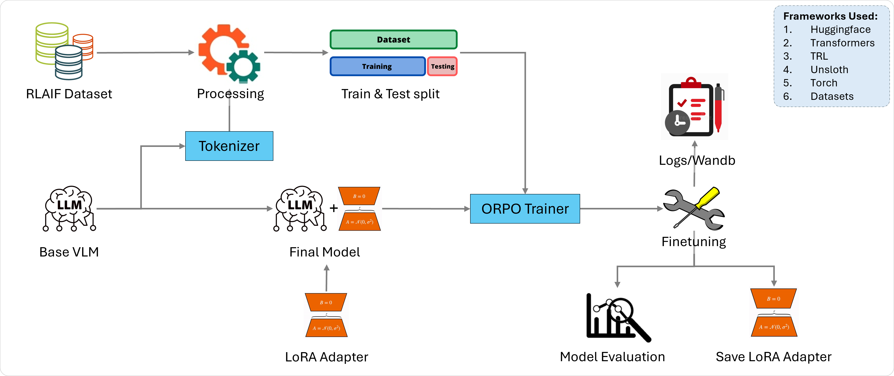
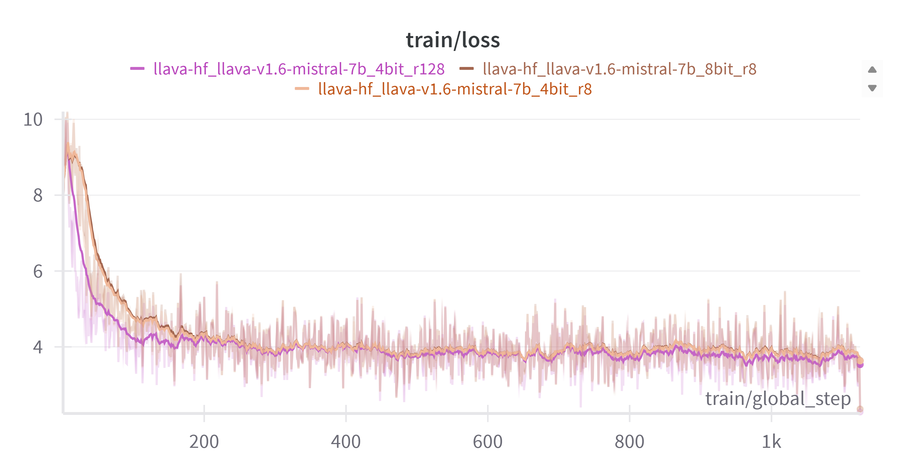
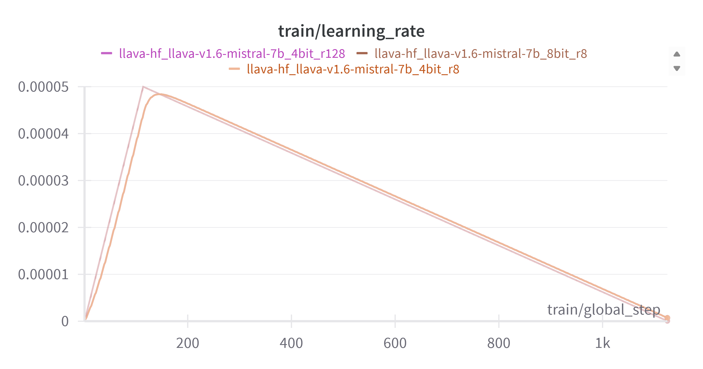
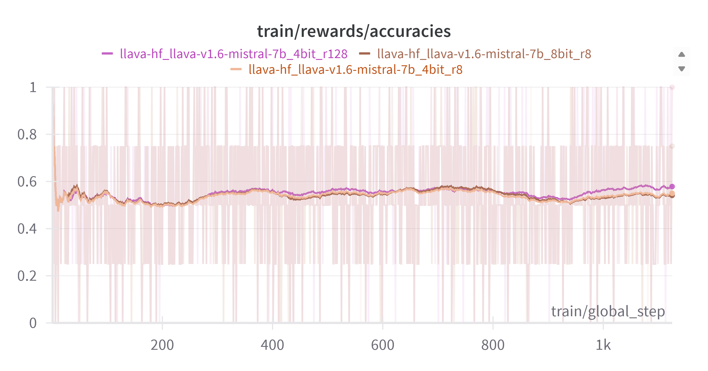
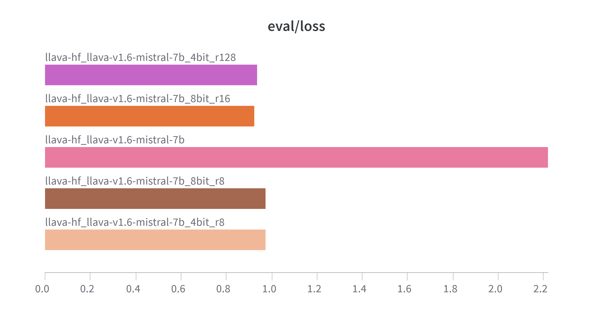
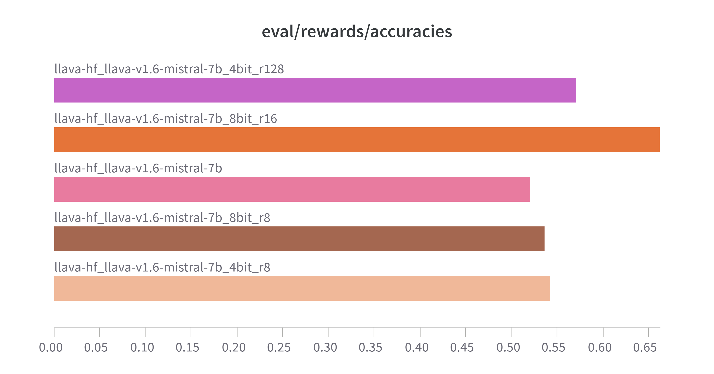
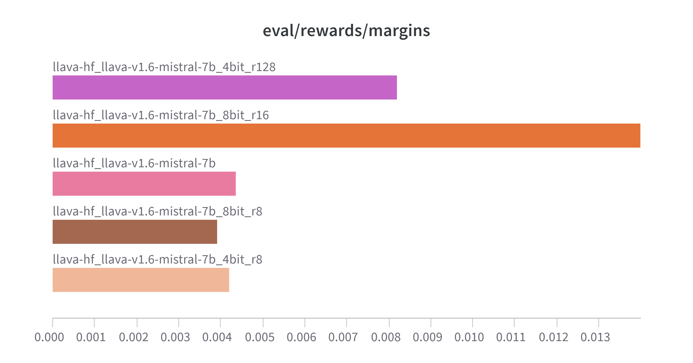
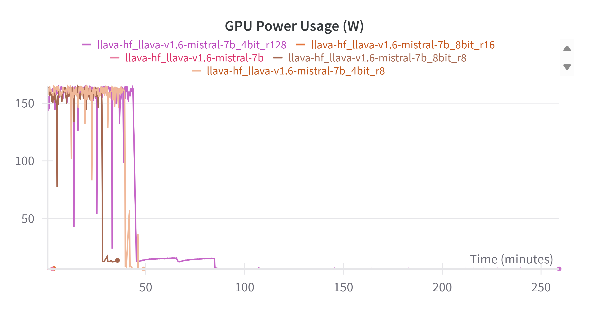
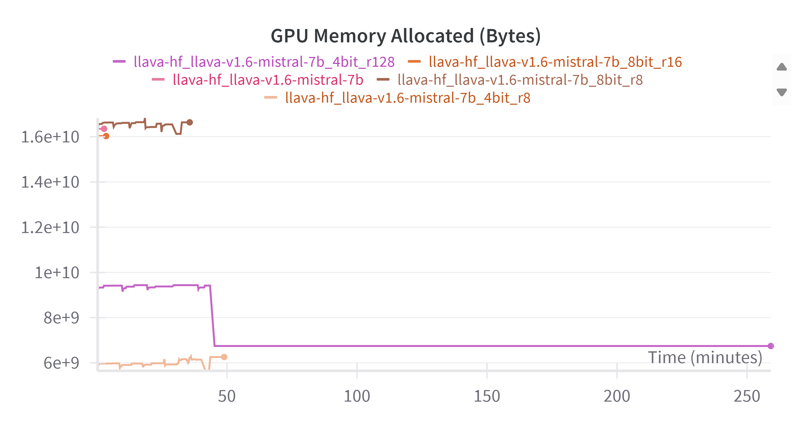
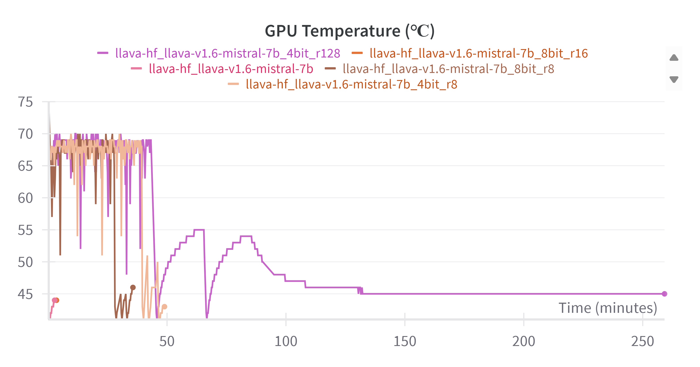

# 🚀 ORPO Fine-Tuning Pipeline for LLaVA-style Vision-Language Models

This repository provides a fully configurable and extensible pipeline to fine-tune **FastVision LLaVA models** using the **ORPO (Odd Ratio Preference Optimization)** training paradigm with support for **LoRA**, **QLoRA**, and **Full finetuning** strategies. It uses opensource Multimodal Language Modal language model and Dataset from Huggingface to finetune the model leveraging **RLHF**.

---

## 🧠 Code Overview

* **`train.py`** — Main training entry point. Handles model loading, dataset preprocessing, training, and evaluation.
* **`config_loader.py`** — Loads configuration from a YAML file to decouple parameters from code logic.
* **`helper.py`** — Utility functions for dataset formatting and tokenization.
* **`configs/*.yaml`** — Configuration files for different experimental setups (LoRA, QLoRA, full finetuning, etc.).

---
## 🖇️ Pipeline



---

## 📦 Installation

### 1. Clone the Repository

```bash
git clone https://github.com/gaurav00700/FineTuning-VisionLanguageModel-LLaVa.git
cd FineTuning-VisionLanguageModel-LLaVa
```

### 2. Create & Activate a Python Environment

```bash
conda create -n llm python=3.12 -y
conda activate llm
```

### 3. Install Dependencies

```bash
pip install -r requirements.txt
```

> Required packages include `transformers`, `unsloth`, `trl`, `torch`, `datasets`, `wandb` and others.

---

## ⚙️ Configuration

Create a YAML config file like `configs/train_eval.yaml`:

```yaml
base_model: "llava-hf/llava-v1.6-mistral-7b"
dataset_name: "openbmb/RLAIF-V-Dataset"
output_dir: "./outputs"
run_name: "llava-v1.6-mistral-7b"
load_in_4bit: true
load_in_8bit: false
full_finetuning: false
finetune_vision_layers: true
finetune_language_layers: true
finetune_attention_modules: true
finetune_mlp_modules: true
dtype: "auto"
r: 16
lora_alpha: 16
lora_dropout: 0.0
max_seq_length: 4096
evaluation: true
num_train_epochs: 1
max_steps: 100
```

---

## 🚀 Running the Script
* Huggingface account must be configured to download [Model](https://huggingface.co/models) and [Dataset](https://huggingface.co/datasets)
* Refer Huggingface [Quickstart](https://huggingface.co/docs/huggingface_hub/en/quick-start)
### 🏁 Start Training/Finetuning and Evaluation

```bash
python train.py configs/train_eval.yaml
```

* Training logs will be printed to console **and** saved to `outputs/logs/{run_name}.log`.
* Training metrics (loss, eval accuracy) are tracked on **Weights & Biases** if logged in.

---

## 📊 Weights & Biases Logging

Ensure you're logged in or provide the `wandb_api_key` in `.env` / `config.yaml` / or set environment variable `WANDB_API_KEY`.

```bash
wandb login
```

The script automatically logs all training and evaluation stats.

You can monitor your training live:

```
https://wandb.ai/your_user/your_project
```

---

## 📊 Validation Results

After training, evaluation is automatically performed (if enabled in config). Results include:

* **eval_loss**
* **eval_rewards/accuracies**
* **eval_rewards/margins**
* **eval_rewards/chosen**
* **eval_rewards/rejected**
---

## 🦚 Model Outputs

* Trained LoRA and tokenizers are saved to `outputs/LoRA/{run_name}`. 
* We can load them on the top on Basemodel using below command.

```python
from unsloth import FastVisionModel

model, tokenizer = FastVisionModel.from_pretrained(
    model_name = "outputs/LoRA/{run_name}"
)
```

---

## 🧰 Finetuning Techniques Supported

* ✅ LoRA / QLoRA with 4-bit or 8-bit quantization
* ✅ Full finetuning (disable quantization & enable `full_finetuning`)
* ✅ Gradient checkpointing for long context handling
* ✅ Selective tuning of backbone, vision, or attention layers

---

## 📍 Design Report

### ✔️ Problem Tackling

* We used Unsloth's FastVisionModel as the base to ensure compatibility with LLaVA.
* Unsloth enables the finetuning with reduced consumption of VRAM.
* Applied ORPO from TRL for preference-based fine-tuning in a single step approach.

### 🧩 Code Organization

* Modular script (config, helper, logger, trainer)
* Logging integrated with both **console** and **file logs**
* W\&B used for experiment tracking

### 🎯 Training & Validation

* Run with a single config line: `python train.py <path/of/config.yaml>`
* Evaluation auto-executed after training (if enabled)
* Logs + metrics auto-saved

### 🔬 Validation Analysis

* Training and evaluation metrics stored on W\&B
* Logs also stored locally under `outputs/logs/`
* Intermediate checkpoints saved every 50 steps

### 🔬 Derived Insights

* LoRA with 4-bit with `LoRA rank=16` is efficient for consumer grade GPUs with lower VRAM (~6-8GB)
* LoRA with 8-bit with higher rank shows better results but requires more VRAM (~16GB)
* Selective MLP/Attention tuning yields better performance than full backbone

---

## 📂 Project Structure
```bash
.
├── assets/                 # images
├── configs/
│   └── train_eval.yaml     # Config file (edit per run)
├── lib/
│   ├── config_loader.py    # Load and Parse configurations 
│   └── helper.py           # Helper module
├── outputs/
│   ├── checkpoints/        # Saved checkpoints
│   ├── logs/               # Saved logs
│   └── LoRA/               # Saved LoRA adapters
├── train.py                # Main script for training
├── requirements.txt        # package to be installed
└── README.md
```
---
## 📸 Visualizations
### 🏋️ Training Metrics
| Epoch Loss                 | Learning Rate            | Reward Accuracies                 |
| -------------------------- | ------------------------ |  ---------------------------- |
|  |  |  |

📉 Evaluation Metrics

| Epoch Loss                 | Reward Accuracy            | Reward Margin (Chosen Reward - Rejected Reward)                 |
| -------------------------- | ------------------------ |  ---------------------------- |
|  |  |  |

📟 System Metrics

| GPU Power Usage (W)        | VRAM Usage (Bytes)       | GPU Temperature (C)           |
| -------------------------- | ------------------------ |  ---------------------------- |
|  |  |  |

---
## 🔮 Future Improvements

* [ ] Further experiments with finetuning different layers
* [ ] Hyperparameter tuning using optimization technique such Grid search, random search or Bayesian Optimization 
* [ ] Support for exporting models to GGUF/llama.cpp for local serving of VLM through Ollama/lamma.cpp and vLLM
* [ ] Add a UI-based inference tool for visualization

---

## 🙌 Acknowledgments

* [Unsloth](https://github.com/unslothai/unsloth)
* [HuggingFace Transformers](https://github.com/huggingface/transformers)
* [TRL by HuggingFace](https://github.com/huggingface/trl)
* [W\&B](https://wandb.ai)
